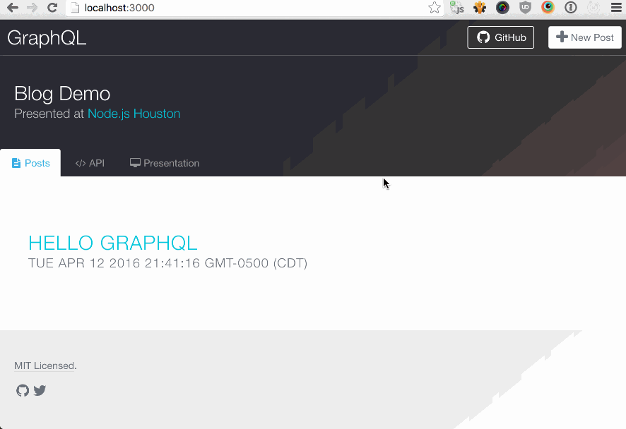

# GraphQL Demo

> A functioning introduction to GraphQL for [Node.js Houston][0]
> – <http://www.meetup.com/NodejsHouston/events/229815892/>

This [presentation][1] & [demo](#demo) covers the following concepts:

- Benefits of GraphQL over REST.
- GraphQL structure vs. JSON.
- Adding `express-graphql` to `express` as a middleware.
- Using GraphiQL's interface.
- Querying a DB via GraphQL (i.e. queries).
- Writing to a DB via GraphQL (i.e. mutations).
- Loading & caching data with `dataloader`.
- Resources for diving deeper with GraphQL.

- - -

## Demo

> 

### Running the Demo

First, ensure you have the following dependencies installed:

- MySQL (`brew install mysql`)
- Node

```shell
$ nvm use
$ npm install
$ npm start
```

Open <http://localhost:3000/>.

### Special Thanks

- @kenwheeler's [Spectacle](https://github.com/FormidableLabs/spectacle)
- @thejameskyle's [spectacle-code-slide](https://github.com/thejameskyle/spectacle-code-slide)

[0]: http://www.meetup.com/NodejsHouston/
[1]: presentation.pdf
